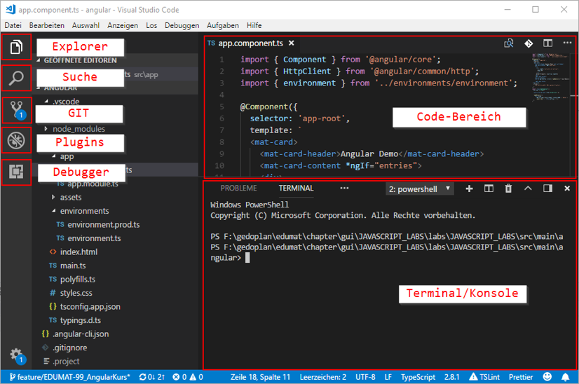

= Visual Studio Code: Einrichtung

== 1. Vorbemerkung
Visual Studio Code (VSC) ist ein von Microsoft bereitgestellter freier Quelltexteditor. Dank der großen Anzahl von verfügbaren Erweiterungen lässt sich mit diesem Editor nahezu jede Programmiersprache / Formate bequem bearbeiten. Insbesondere bei der Entwicklung von Angular- / HTML-Anwendungen erfreut sich VSC großer Beliebtheit. Grundsätzlich lassen sich Angular Anwendungen auch mit den bekannten Java IDEs bearbeiten, die gegebenenfalls mit zusätzlichen Erweiterungen angereichert werde müssen. Dabei erreichen diese, Stand heute, jedoch bei weitem nicht den Komfort von VSC.

== 2. Download / Installation
VSC kann kostenfrei heruntergeladen werden, sowohl als Installer als auch als ZIP-Version. Dabei stehen sowohl Windows, als auch Linux und MAC Versionen zur Verfügung:

https://code.visualstudio.com/

_Bei Seminaren, die dieses Tool benötigen, wird der Download durch den Aufruf von mvn im Verzeichnis labs bereits durchgeführt und die Anwendung im Verzeichnis
tools\target\visual-studio-code bereitgestellt._

== 3. Grundsätzliche Bedienung der Anwendung

Eine zentraler Shortcut ist dabei: Ctrl+Shift+P . Dieser ruft die Befehlspalette auf, über die nahezu jede Funktion von VSC und installierten Erweiterungen aufgerufen werden kann.

== 4. VSC im Seminar
Wie oben beschrieben wird VSC mittels Maven bereits heruntergeladen. Bei dieser Version von VSC handelt es sich um die ZIP-Version des Editors, die bereits mit einigen Plugins angereichert wurde:

* alphabotsec.vscode-eclipse-keybindings
** Tastenkürzel wie bei Eclipse
* johnpapa.angular-essentials
** Angular Support
* .zignd.html-css-class-completion
** CSS-Klassen Erweiterung
* esbenp.prettier-vscode
** Formatierer für CSS, JavaScript, TypeScript, HTML